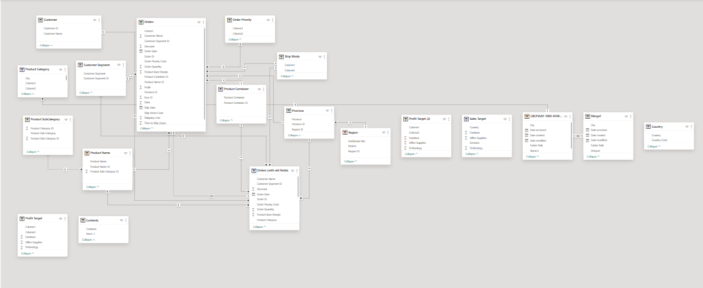
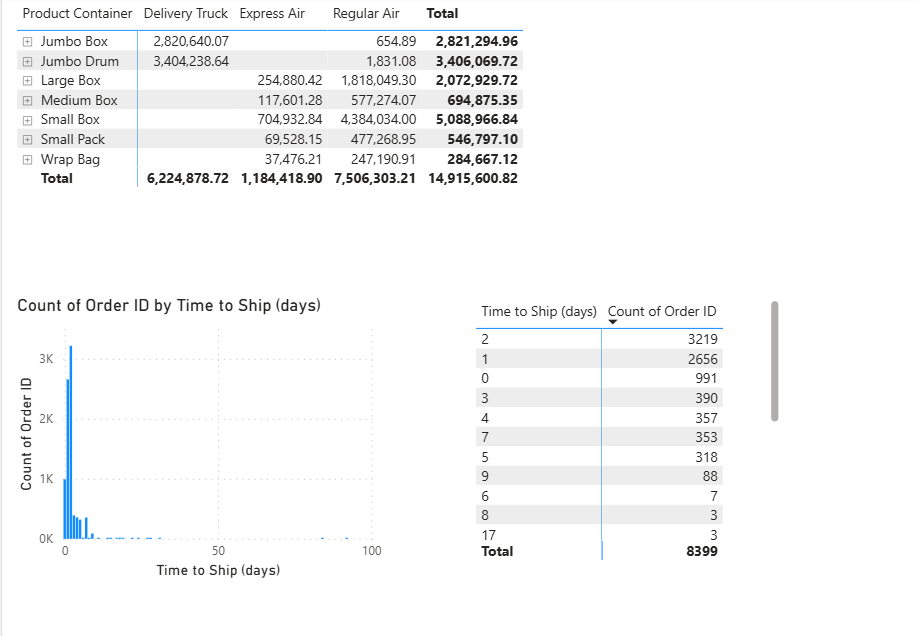

# 📦 Power BI - Shipping Performance Analysis

This Power BI project analyzes order delivery performance across product containers and shipping methods.  
It leverages data modeling, calculated measures, and time-based visualizations to extract actionable insights.

---

---

## 🧩 Data Model Overview

The project is based on a custom-built data model that includes:

- Customer segments, orders, and product containers
- Shipping methods and delivery timelines
- Target profitability and region-based filters
- Calculated columns and measures for KPI tracking

📷 **Data model layout:**

---

## 🚚 Shipping Performance Analysis

The report includes an analysis of order counts and shipping delays:

- Time to ship (in days)
- Order volume distribution
- Shipping method breakdown per product container

📷 **Sample visual:**

---

## 📊 Dataset & Source

The dataset was derived from educational material provided during a Power BI learning module.  
It was cleaned and transformed within Power BI using Power Query and DAX expressions.

---

## 🛠️ Features & Techniques

- Data model with normalized relationships  
- Custom DAX measures (e.g. % orders shipped <1 day)  
- Conditional formatting & slicers  
- Performance by container type and time to ship

---

## 📁 Folder Structure

